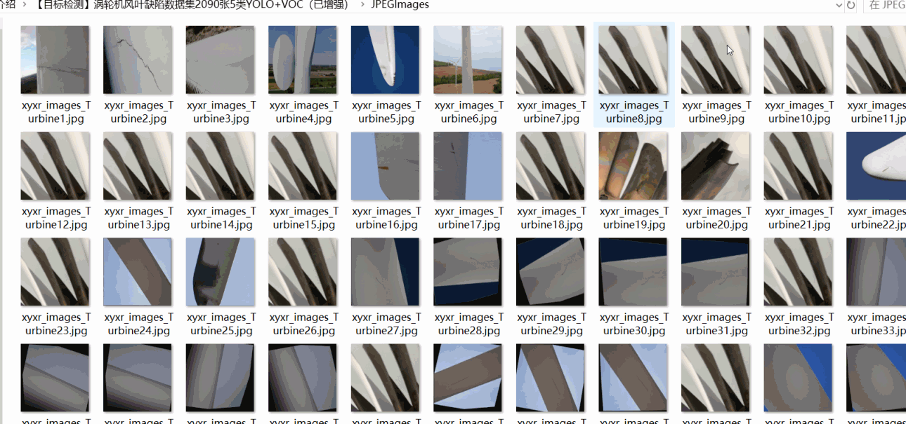
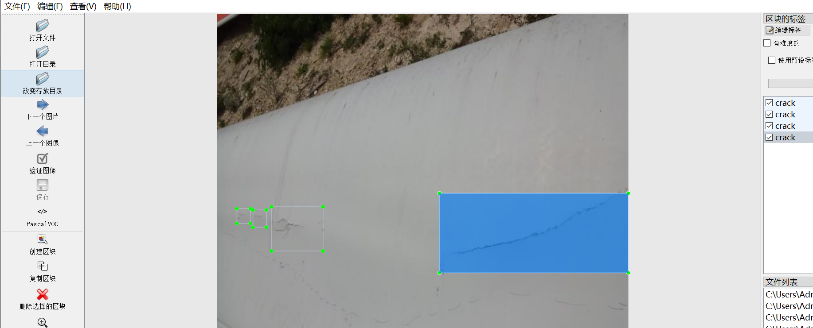
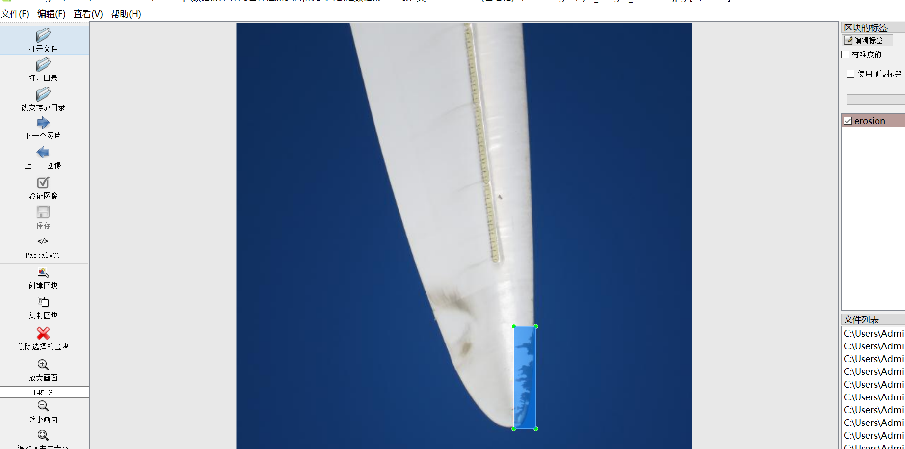
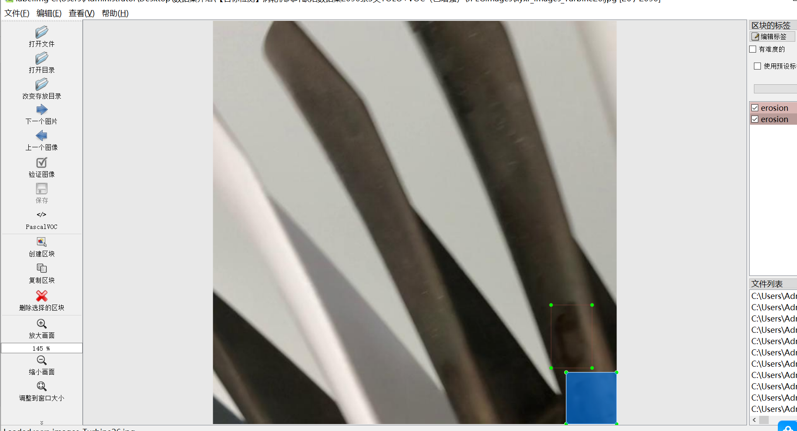

# [Object Detection] Turb Wind Leaf Defect Dataset 2090 images5-classYOLO+VOC（(Augmented) ）

【Object Detection】Turbine Blades Defects Dataset: 2090 Images, 5 Classes, YOLO+VOC (Enhanced)

Dataset Format: VOC format + YOLO format

The compressed file contains: three folders, each storing images, xml files, and text files.

Total jpg images in JPEGImages folder: 2090

The XML files in the Annotations folder total: 2090.

The total number of txt files in the labels folder is: 2090.

Number of tag types: 5

Tag names: ["Burn Mark","crack","dent","erosion","scratch"]

Tag Chinese: Scorch mark, crack, dent, corrosion, scratch

The number of boxes for each label (Note that the order of labels in the Yolo format does not correspond to this, but is based on the classes.txt file in the labels folder):

Burn Mark frame count = 449

crack frame count = 1136

dent frame count = 537

erosion frame count = 718

scratch frame count = 980

Total boxes: 3820

Picture clarity (Resolution: Pixels): Clear

Image Enhancement: Yes

Shape of the label: Rectangular box, used for object detection and recognition.

Dataset Type ：89m

Special Notice: This dataset does not guarantee the accuracy or precision of the trained models or weight files. The dataset only provides accurate and reasonable annotations.

## Images

---

Here is a pay link on Stripe (https://buy.stripe.com/3cs8yP7sY87d0vu9AB). Please contact me lonlonago@foxmail.com after funding $89, and I will send you a complete data files, thank you!

